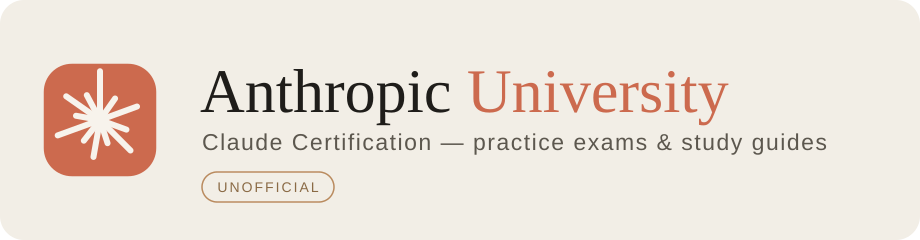
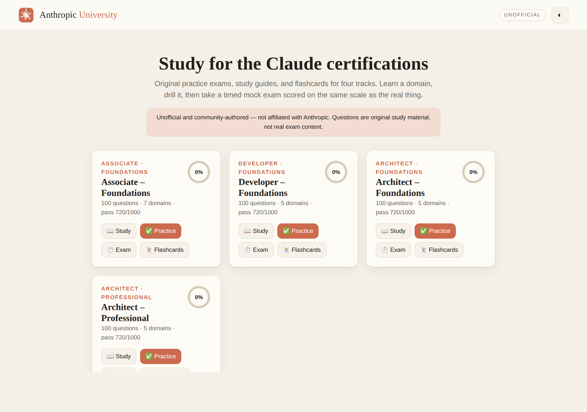
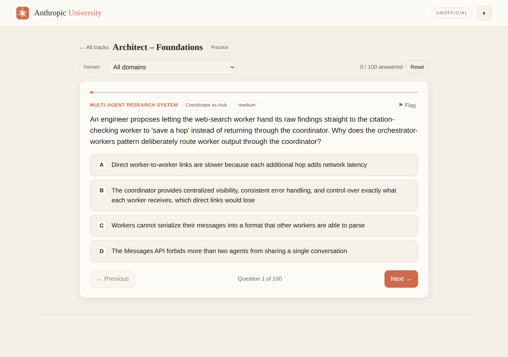
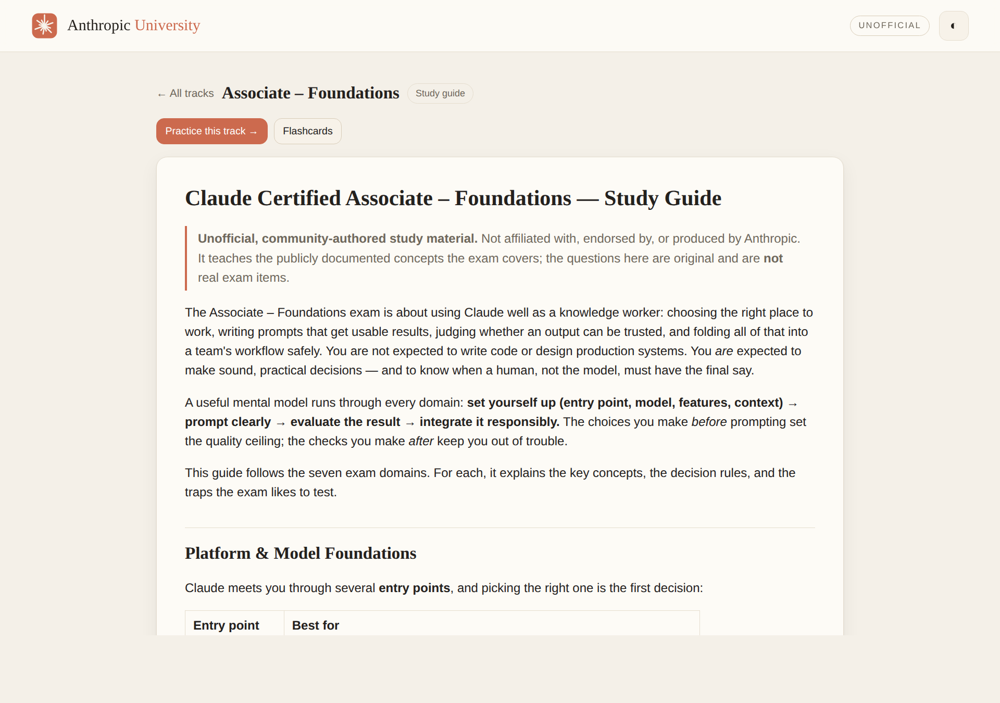
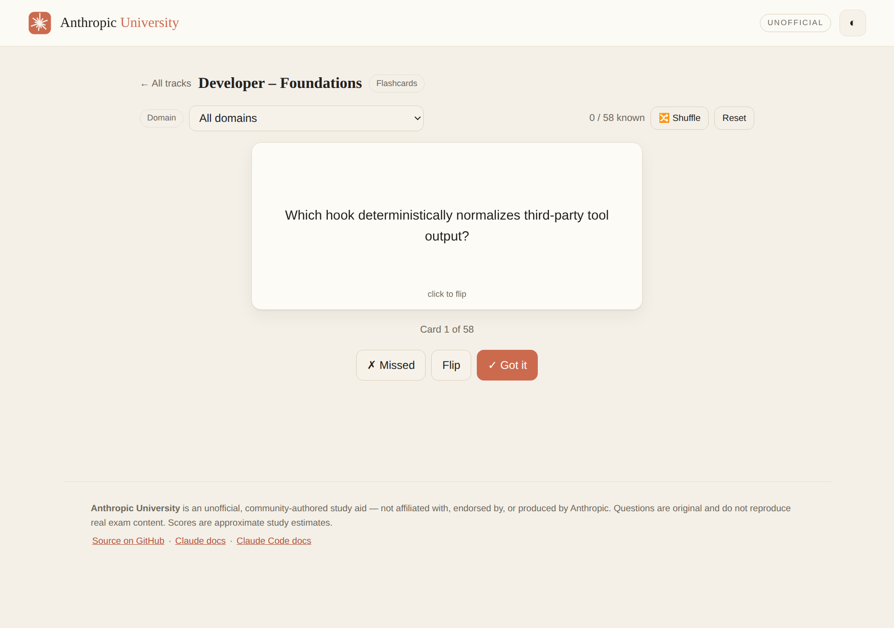

<p align="center">
  
</p>

<p align="center">
  
  
  
  
  
</p>

# Anthropic University

An open study hub for the **Claude Certification** program: original practice exams, study guides,
and flashcards for four tracks, plus an **interactive web app** and a **Claude Code plugin
marketplace** you can install to study right in your terminal.

> [!IMPORTANT]
> **Unofficial & community-authored.** Anthropic University is **not** affiliated with, endorsed by,
> or produced by Anthropic. Every question is **original**, written to teach publicly documented
> concepts — it does **not** reproduce real certification exam content. Use it to *prepare*, and
> always follow the [Certification Exam Policy](https://www.anthropic.com) (no AI assistance *during*
> the exam, no sharing of real exam questions). The logo and artwork here are original.

## What's inside

Five tracks — the four Claude certifications plus a **Claude Cowork** course companion — each with a
question bank, a study guide, and a flashcard set:

| Track | Study guide | Practice exam | Flashcards |
| --- | --- | --- | --- |
| **Claude Certified Associate – Foundations** | [guide](content/associate-foundations/study-guide.md) | [100 Q](content/associate-foundations/practice-exam.md) | [cards](content/associate-foundations/flashcards.md) |
| **Claude Certified Developer – Foundations** | [guide](content/developer-foundations/study-guide.md) | [100 Q](content/developer-foundations/practice-exam.md) | [cards](content/developer-foundations/flashcards.md) |
| **Claude Certified Architect – Foundations** | [guide](content/architect-foundations/study-guide.md) | [100 Q](content/architect-foundations/practice-exam.md) | [cards](content/architect-foundations/flashcards.md) |
| **Claude Certified Architect – Professional** | [guide](content/architect-professional/study-guide.md) | [100 Q](content/architect-professional/practice-exam.md) | [cards](content/architect-professional/flashcards.md) |
| **Claude Cowork – Foundations** *(course companion)* | [guide](content/cowork-foundations/study-guide.md) | [60 Q](content/cowork-foundations/practice-exam.md) | [cards](content/cowork-foundations/flashcards.md) |

### Course coverage

The five tracks line up with the official prep courses in the **Claude Partner Network**:

| Prep course | Covered by |
| --- | --- |
| Claude Certified Associate – Foundations *(7 lessons: Platform & Model Foundations · Prompting & Task Execution · Evaluating & Validating Output · Workflow Integration & Solution Design · Configuration & Knowledge Management · Governance, Risk & Responsible Use · Troubleshooting & Optimization)* | `associate-foundations` |
| Claude Certified Developer – Foundations *(MSO Foundations · Production-Grade Prompting, Agents & Tool Use · Claude Code, MCP & Integration · Production Engineering, Evals & Security · Accelerators & IP)* | `developer-foundations` |
| Claude Certified Architect – Foundations | `architect-foundations` |
| Claude Certified Architect – Professional | `architect-professional` |
| Introduction to Claude Cowork *(Cowork 101 — 14 lessons)* | `cowork-foundations` |

The four **CPN foundation courses** — *Introduction to Agent Skills*, *Building with the Claude API*,
*Introduction to Model Context Protocol*, and *Claude Code in Action* — underpin the Developer and
Architect tracks (tool use and the agent loop, `stop_reason`, MCP primitives and transports, Claude
Code configuration, skills, and plugins), and their concepts run throughout those banks.

Grounded in the official docs: [platform.claude.com/docs](https://platform.claude.com/docs) ·
[code.claude.com/docs](https://code.claude.com/docs) · Model Context Protocol.

## Try the interactive app

A self-contained web app (vanilla JS, no build step) with four modes:

- **📖 Study** — read the guide for a track, jump by domain
- **✅ Practice** — one question at a time, immediate feedback, explanations, and a study-area tag
- **⏱️ Exam** — a timed run scored on an approximate **100–1000 scale (720 to pass)**, with a
  per-domain breakdown and a review of everything you missed
- **🃏 Flashcards** — flip, shuffle, and mark cards known/unknown

Progress is saved in your browser (`localStorage`). Light/dark aware.

- **Live site:** `https://patrickking67.github.io/anthropic-university/` *(publishes automatically
  once this branch merges to `main` — see [Deploy](#deploy--github-pages))*
- **Locally:** just open [`docs/index.html`](docs/index.html) in a browser — it works from `file://`,
  no server needed.

<p align="center">
  
  
</p>
<p align="center">
  
  
</p>

## A suggested study workflow

1. **Read** the study guide for your track end to end.
2. **Practice** by domain until you can explain *why* each answer is right — read the explanations,
   not just the letters.
3. **Drill flashcards** for the concepts that keep slipping.
4. **Take a timed exam.** Aim comfortably above 720. Review every miss and revisit that domain.

## Use it inside Claude Code

This repo doubles as a Claude Code workspace.

**Docs on tap.** [`.mcp.json`](.mcp.json) wires up the official Claude Code Docs MCP server, so Claude
can look things up while you study or contribute.

**Install the study plugins** from the built-in marketplace ([`.claude-plugin/marketplace.json`](.claude-plugin/marketplace.json)):

```text
/plugin marketplace add patrickking67/anthropic-university
/plugin install exam-prep@anthropic-university
/plugin install study@anthropic-university
/plugin install flashcards@anthropic-university
/plugin install coach@anthropic-university
```

Then, in a session:

```text
/exam-prep:mock-exam architect-foundations 20     # interactive, scored practice exam
/exam-prep:quiz developer-foundations             # quick quiz with instant feedback
/study:explain prompt caching                     # concept deep-dive, cited from the docs
/study:roadmap architect-professional 14          # a 14-day study plan
/flashcards:flashcards cowork-foundations         # spaced-repetition drilling
/coach:weak-areas associate-foundations           # find and fix your weak domains
```

In the plugins area the marketplace shows as **Anthropic University**, with five plugins — clean
display names, each bundling several skills (and, where useful, an agent):

- **Exam Prep** (`exam-prep`) — an interactive exam runner: `mock-exam` presents questions one at a
  time and scores them on the 100–1000 scale, plus `quiz`, `diagnostic`, and a `proctor` agent.
- **Study** (`study`) — read the guide (`study-guide`), get a concept explained with **official-docs
  citations** via the bundled Claude Code Docs MCP (`explain`), or plan your prep (`roadmap`); plus a
  Socratic `tutor` agent.
- **Flashcards** (`flashcards`) — spaced-repetition `flashcards` drilling and a last-hour `cram`.
- **Coach** (`coach`) — `weak-areas`, `grade-answer`, and `plan`, plus an adaptive `coach` agent.
- **Author** (`author`) — maintainer tools: `author-question`, `review-bank`, and `build`, plus a
  `bank-reviewer` agent (mirrors the repo-local skills in [`.claude/skills/`](.claude/skills)).

## How it's built

`content/<track>/questions.json` and `flashcards.json` are the **single source of truth**. A tiny,
dependency-free Node script regenerates everything else:

```bash
node scripts/build.mjs          # validate + regenerate markdown exams, flashcards, and app data
node scripts/build.mjs --check  # validate only (used by CI) — fails on schema errors or duplicates
```

See [`CLAUDE.md`](CLAUDE.md) for the schema and repo map, and [`CONTRIBUTING.md`](CONTRIBUTING.md)
for the authoring quality bar.

## Deploy (GitHub Pages)

The [`Deploy GitHub Pages`](.github/workflows/pages.yml) workflow builds the app data and publishes
`docs/` on every push to `main`. It uses `actions/configure-pages` with `enablement: true`, so Pages
turns on automatically the first time it runs — no manual Settings toggle. (Publishing Pages from a
**private** repo requires GitHub Pro/Team/Enterprise, which this repo has.)

## Contributing

New questions, corrections, and better explanations are welcome — accuracy is the whole point. Read
[`CONTRIBUTING.md`](CONTRIBUTING.md), keep content original, and open a PR. CI validates every change.

## License

Code and tooling: [MIT](LICENSE). Study content is provided for personal exam preparation. This
project is unofficial and not affiliated with Anthropic; "Claude" and "Anthropic" are trademarks of
Anthropic, referenced here descriptively.
